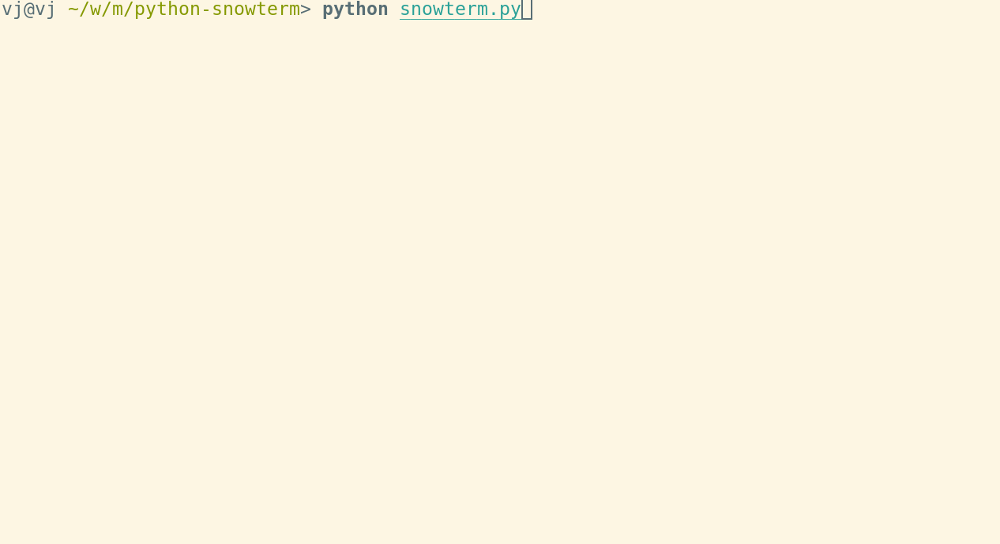

Happy New Year, and happy winter!

# ASCII snow in your terminal



Usage:

```shell
  python snowterm.py [SPEED]
```

Where `SPEED` is integer representing percents.

Less than 100 lines of code, yay! Tested on macOS and on Linux with Python2.7 and Python3.

## LICENSE
WTFPL
